## 第一站：江门 

### 开平碉楼

开平碉楼是广府文化的代表之一，是集防卫、居住和中西建筑艺术于一体的多层塔楼式建筑，可惜去时天气比较阴沉。

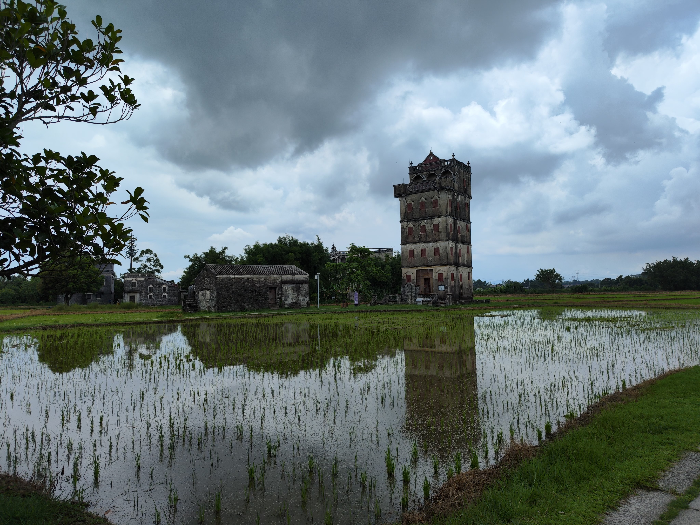 

### 赤坎古镇

赤坎古镇新建了一个现代度假村，做得挺不错的。别的不说，那里的夜景确实好看。

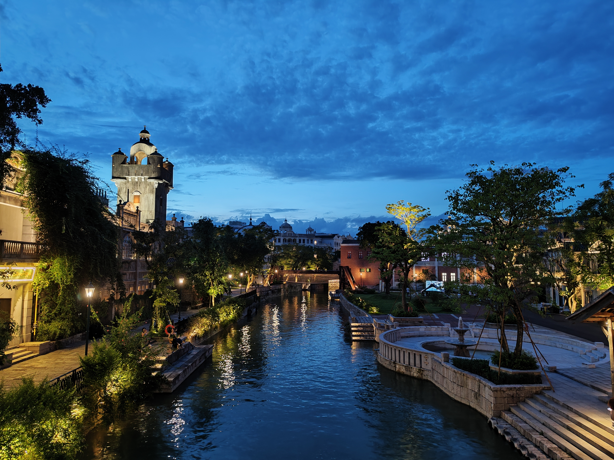

都有种威尼斯的感觉了~

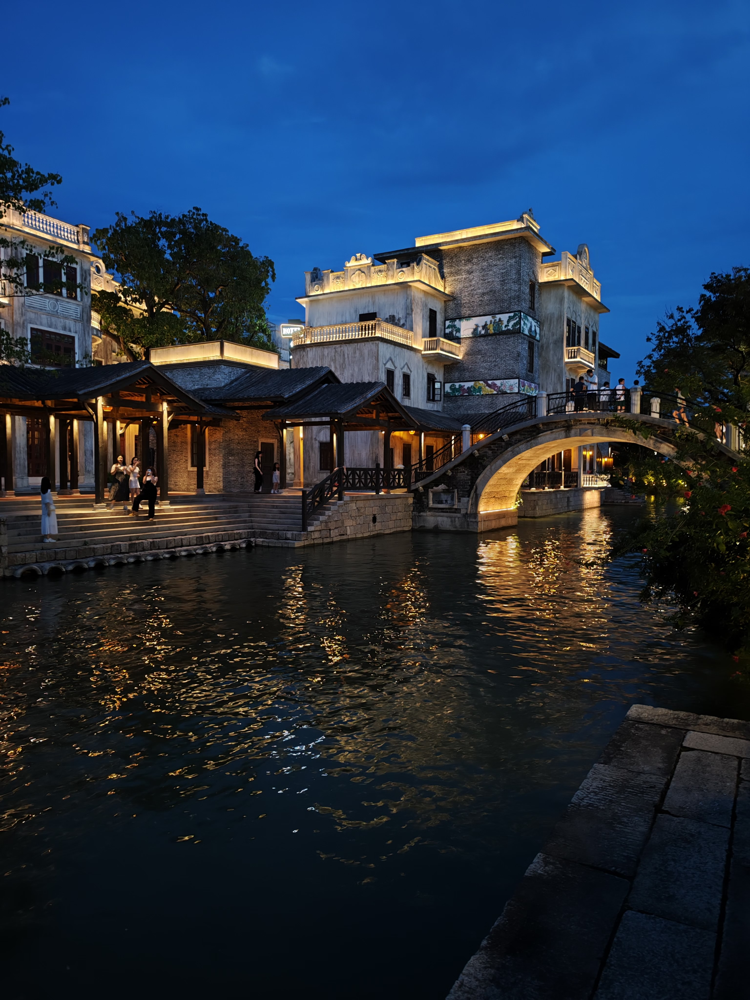 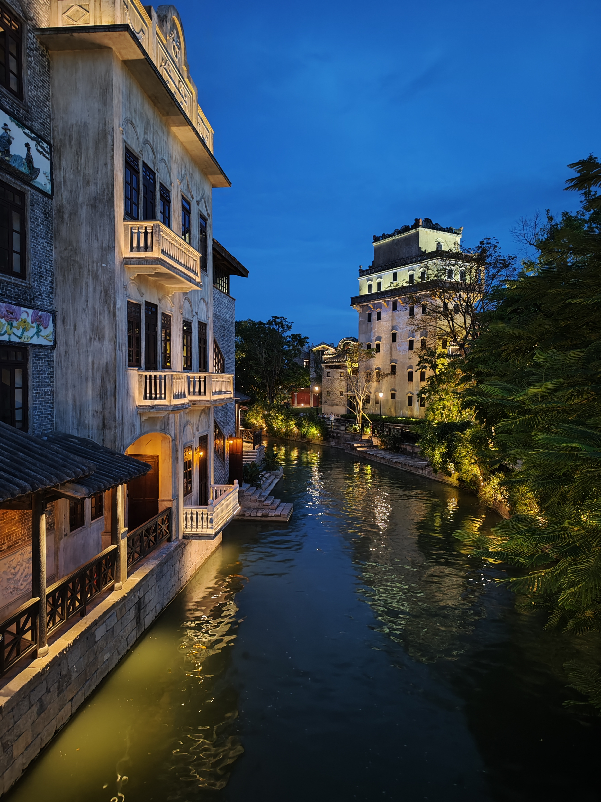

还有游园列车~

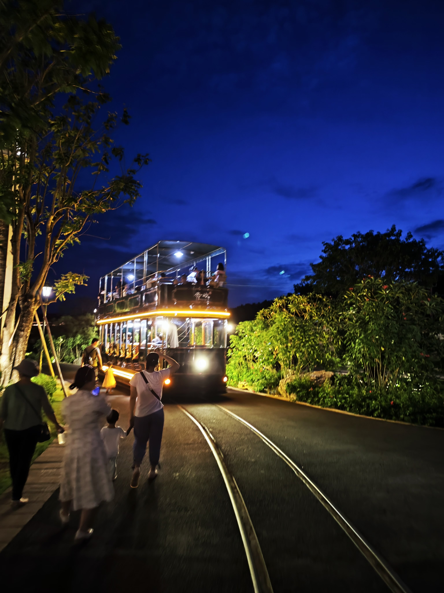

## 第二站：北京

### 长城

世界七大奇迹之一，总是要来看一下的。只爬了一小段就累了，很难想象当年怎么建起来的。（P.S. 长城是真的陡）

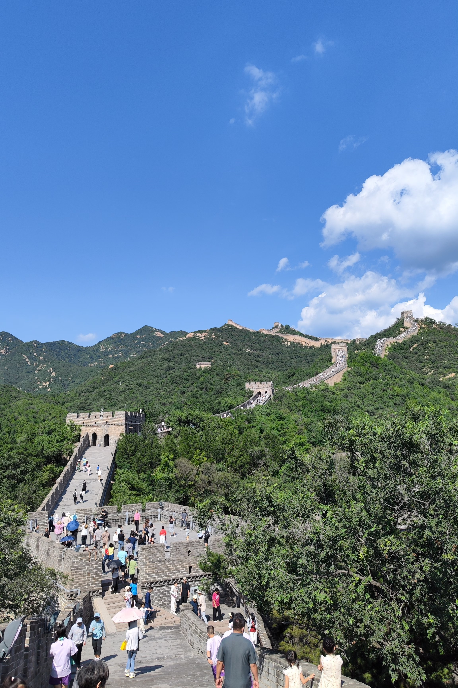

### 颐和园

好看是真好看，人也是真的多~

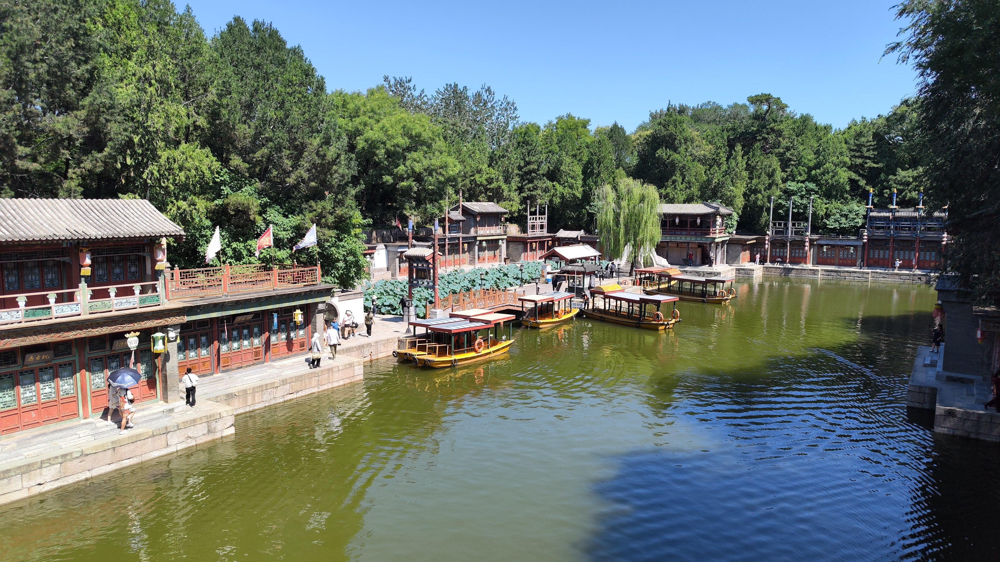

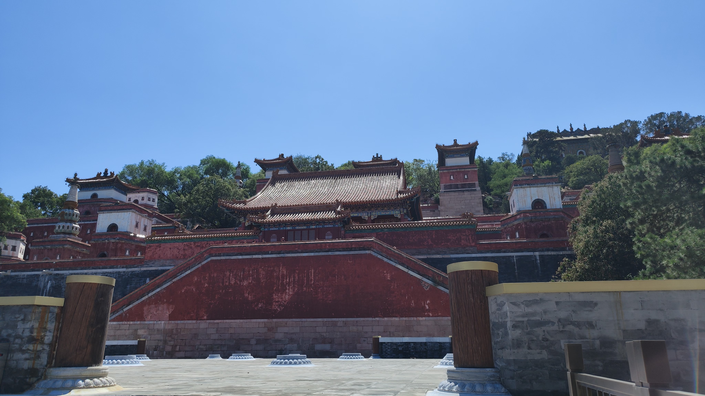

### 天坛

第二次来了，上次来还是十年前~

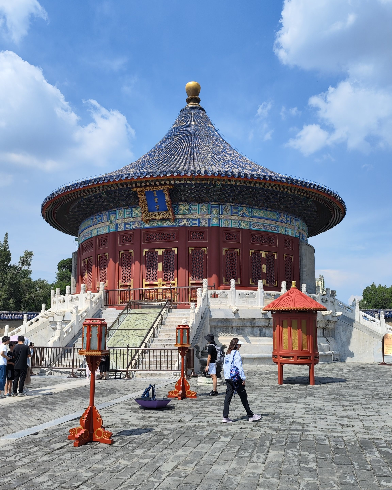

### 大栅(shí)栏(lànr)

拥有奇特读音的著名商业街区（真的很多好吃的！！）

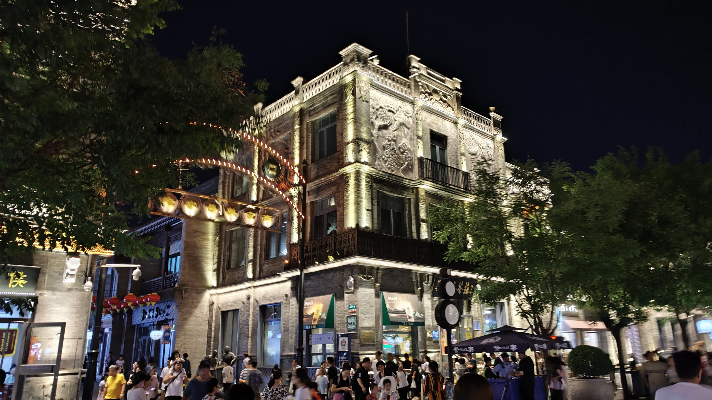 

充满了生活气息~

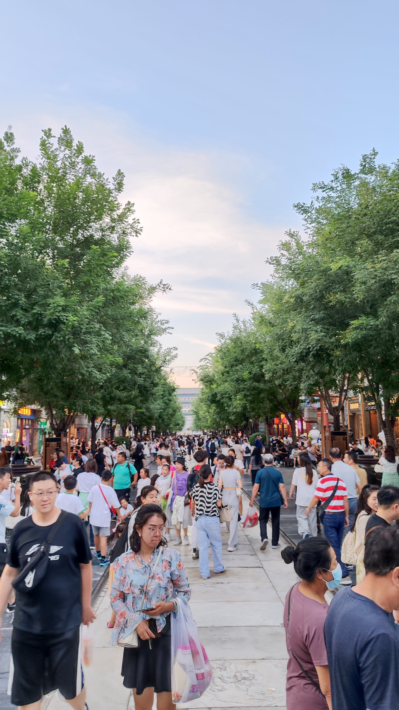
