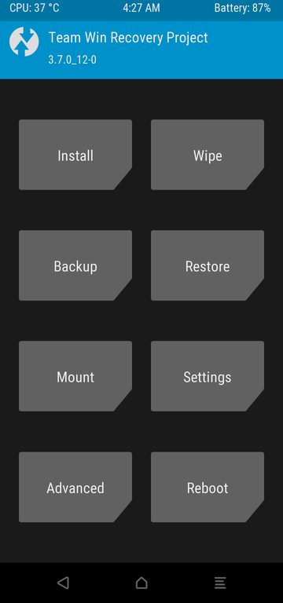

## 前言

本教程以小米手机刷机为例，理论适用于所有安卓手机。


## 前提条件 

- 备份！备份！备份！
- 手机解锁BootLoader，需要绑定手机账户7天以上。解锁时手机会被双清（data和cache）
- 以小米手机为例，需要在 [官网](www.miui.com/unlock/) 上申请解锁。
- 准备好Android adb
- 准备好要刷的系统，在解锁完BootLoader后提前放入手机某个文件夹（此处使用卡刷包，小米EU版系统[链接](https://xiaomirom.com/rom/)）


## 安装 TWRP Recovery

手机分区有三种，A only，A/B，vAB。其中A only和A/B都有Recovery分区，vAB则没有。

其中，A/B分区是为了方便系统更新。启动时仅使用其中一个分区（比如A），升级时系统会把升级内容存放在A分区，你继续使用B分区。

vAB分区则是虚拟出的AB分区，减少了损耗。目的与A/B分区相同。

- 有Recovery分区的安装方式（通过ADB tools）:

​		```fastboot flash recovery twrp.img``` 

​		```fastboot reboot recovery```

​		这种方式可直接将twrp刷入recovery

- 无Recovery分区的安装方式（通过ADB tools）:

​		```fastboot boot twrp.img``` 

​		```fastboot reboot recovery```

​		最后通过高级选项刷入当前twrp



<center>装好后的TWRP</center>


  ## 选择你想刷的系统文件（需提前放置在某个文件夹）

- 选择安装（install），刷入你的系统文件
- 刷好后，选择清除，格式化data分区

​	重启，结束。


## 可选操作

- 安装[Maigsk](https://github.com/topjohnwu/Magisk) (也就是root)
- 安装[SafetyNet](https://github.com/kdrag0n/safetynet-fix)
- 安装[中国化Magisk模块](https://github.com/MinaMichita/MiuiEULocalizationToolsBox)
